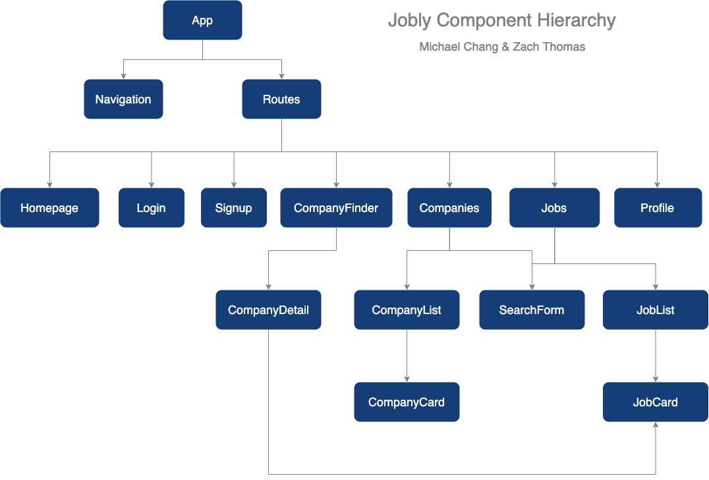

# Jobly

Jobly is a fullstack application where users can search for and apply to job openings. Jobly utilizes a React frontend and an Express.js backend. For ease of deployment, the backend repository has been separated and can be found [here](https://github.com/ZeeTom/Jobly-Backend).

Jobly allows users to sign-up or login. Authentication is implemented with Bcrypt and persists with JSON Web Tokens. Once logged in, users have access to the following features: 
- search for companies by name
- view company details with associated job listings
- search for job listings by position name
- view and edit user profile

You can view the deployed version of Jobly [here](https://joblynow.surge.sh/).

 

## React Component Hierarchy

 

## Setup Instructions

1. Clone and install the backend repository [here](https://github.com/ZeeTom/Jobly-Backend)
2. Navigate into Jobly frontend directory `cd jobly-frontend`
3. Install dependencies `npm install`
4. Start the React App `npm start`

 

## Technologies Used

- [React](https://reactjs.org/) - Javascript frontend framework
- [Node.js](https://nodejs.org/en/) - Javascript backend environment
- [Express](https://expressjs.com/) - Node.js backend framework
- [PostgreSQL](https://www.postgresql.org/) - Relational database system

 

## Authors 

ShareBnB is authored by [Mike Chang](https://github.com/mykeychain) and [Zach Thomas](https://github.com/ZeeTom).

 

## Acknowledgements

While we built both the frontend and backend for this application individually, the frontend is deployed using a version of the backend built by Rithm School. This was provided to ensure all student pairs were working with a consistent backend. 